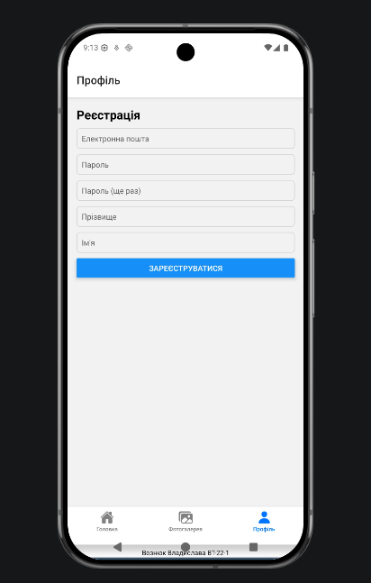
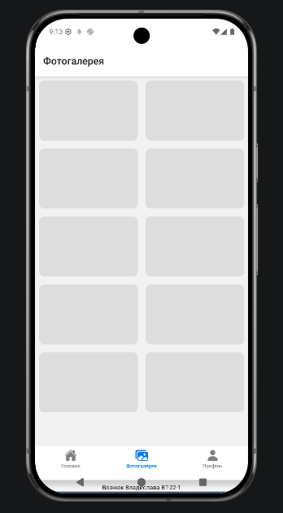
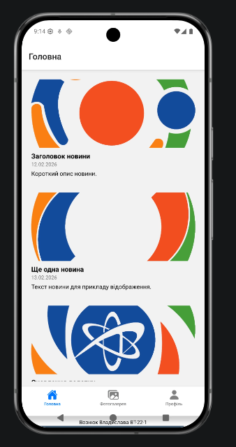

# Лабораторна робота №1

### Опис додатку
Розроблено мобільний додаток на React Native з використанням Expo.
Додаток містить такі екрани:
- Головна (новини з зображеннями)
- Фотогалерея
- Профіль користувача

Для навігації між екранами використано нижнє меню (Bottom Tab Navigation).

### Способи запуску додатку

#### 1. Expo Snack (онлайн)
Проєкт може бути запущений у браузері або на реальному пристрої
за допомогою сервісу Expo Snack.

**Особливості:**
- Не потребує встановлення середовища розробки
- Швидкий запуск та тестування

#### 2. Реальний Android-пристрій
Запуск здійснюється через додаток Expo Go шляхом сканування QR-коду.

**Особливості:**
- Робота на фізичному пристрої
- Коректне тестування інтерфейсу

#### 3. Android Emulator
Проєкт може бути запущений у середовищі Android Emulator
за наявності встановленого Android Studio.

**Особливості:**
- Зручно для налагодження
- Не потребує фізичного пристрою

### Скріншоти

### Використані технології
- React Native
- Expo
- React Navigation
